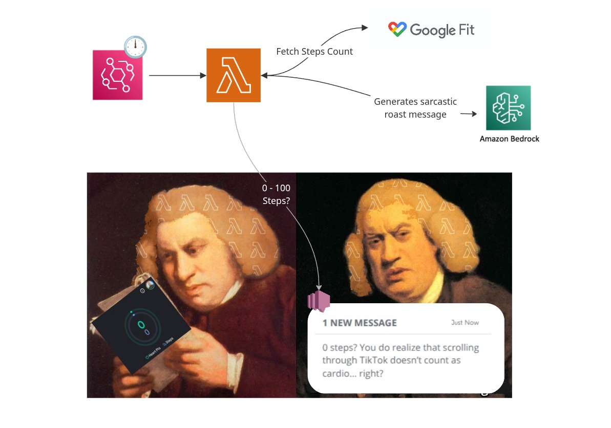

# Roast My Steps

A serverless app that roasts users for low daily step counts using Google Fit API and AWS Bedrock

```Note: This is all in good fun! The roasts are meant to be funny motivation, not actual insults.```

## Architecture



- **AWS Lambda**: Serverless function triggered by EventBridge (daily cron)
- **Google Fit API**: Fetches daily step count data
- **Amazon Bedrock**: Generates sarcastic roast messages using Claude AI
- **Amazon SNS**: Sends notifications to users

## Setup

1. Configure environment variables:
```bash
GOOGLE_CLIENT_ID=your_google_client_id
GOOGLE_CLIENT_SECRET=your_google_client_secret  
GOOGLE_REFRESH_TOKEN=user_refresh_token
GOOGLE_ACCESS_TOKEN=user_access_token
SNS_TOPIC_ARN=your_sns_topic_arn
```

2. Install Packages & run `npm run test:invoke` to get results locally